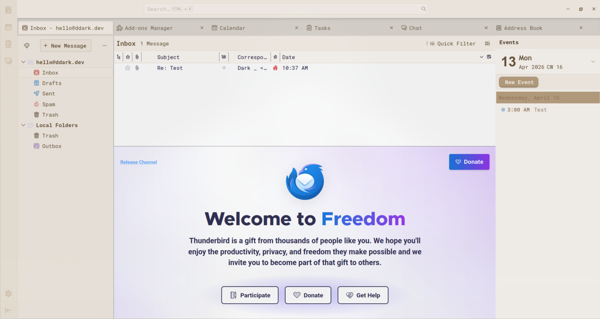
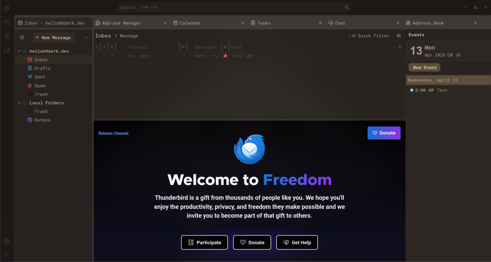
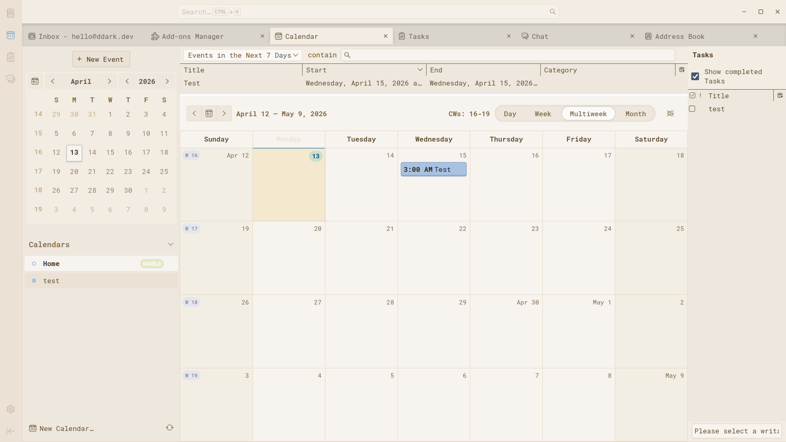
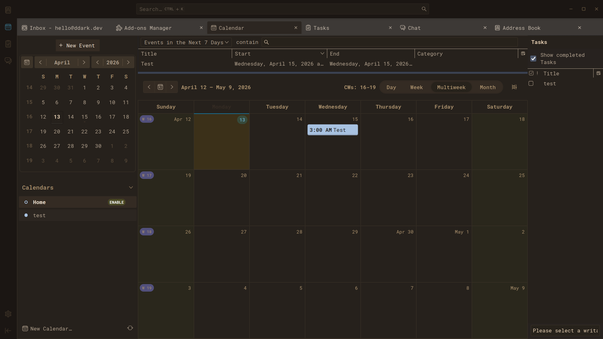

# WashiBird



## Thunderbird Theme


A relaxed, soft theme for Thunderbird featuring neat pastel colours with a subtle cartoon effect. The theme brings a modern, contemporary design to your email client while maintaining a clean and focused user experience.

## ✨ Features

- **Full UI Styling**: Complete theming for Inbox, Message View, Composer, Calendar, and Address Book
- **Theme Modes**: Light, Dark, and System (auto) mode toggle available in Add-on Preferences
- **Colored Blockquotes**: Beautifully styled blockquotes for Plain Text and Simple HTML views
- **Custom Typography**: Driven by Rubik, Overlock, and Chivo font tokens for a cohesive look
- **Privacy First**: No data collection, no external communication, styling only

## 📋 Compatibility

- **Thunderbird**: 128+
- **Manifest**: V2
- **Platforms**: Windows, macOS, Linux

## 🚀 Installation

### From XPI File

1. Set Thunderbird theme to **Default Light** or **Default Dark**
2. Download the `washibird-theme.xpi` file
3. Install the XPI file in Thunderbird (File → Install Add-on From File...)
4. Go to **Add-ons → WashiBird → Preferences** to select your preferred theme mode

### Building from Source

```bash
zip -r washibird-theme.xpi . -x ".git/*" ".github/*" ".gitignore" "preview/*" "biome.json" "AGENTS.md" "README.md" "LICENSE"
```

## 🔧 Permissions

The theme requires the following permissions:

- `messagesRead` - For styling message content
- `messagesModify` - For applying styles to messages
- `compose` - For theming the composer window
- `storage` - For storing theme preferences
- `tabs` - For styling tab elements
- `theme` - For applying the theme

**Privacy Note**: These permissions are used exclusively for UI styling. No data is collected, stored externally, or transmitted to any third-party services.

## 📸 Screenshots





